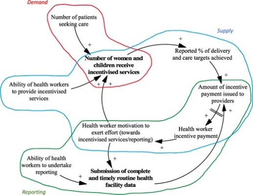


# **Causal Loop Diagrams**

*Why we’ve included this: good example of sloppy, casual notation, with excellent secondary notation; only possible because the ontology is weak*

Start with a field of lettuces. Rabbits come and eat the lettuces. Lots of food means more rabbits, but soon most of the lettuces have been eaten and the rabbits decline in number for lack of food. As the rabbit numbers dwindle the lettuces pick up again; then the rabbits multiply, and so it goes, round and round.

Unlike most of the notations we have mentioned, Causal Loop Diagrams (CLDs) describe things that change over time and influence each other as they change, such as rabbits and lettuces. That’s a heavily simplified example; where CLDs have proved their worth is in teasing out much more complex relationships; they are tools for exploratory understanding, just like mind maps XREF and I should mention that in mind maps. They have proved particularly fruitful as tools to explicate complex social structures, as we shall see below.
## **How CLDs work**
CLDs deal with relationships between variables but they are entirely qualitative, which means to say that numbers don’t get a look in. One variable, say number of lettuces, can influence another, say number of rabbits, in only two ways:

- a positive, ‘supporting’, relationship – as the number of lettuces goes up, the number of rabbits goes up; marked as S on diagrams;
- or a negative, ‘opposing’, relationship – as the number of rabbits goes up, the number of lettuces goes down; marked as O on diagrams.

When variable A influences variable B *and* variable B influences variable A (as in our example) we have a feedback loop, which is why these diagrams are called Causal Loop diagrams. The rabbits and lettuces would usually be drawn like this:

1  Causal Loop Diagram for rabbits and lettuces: more rabbits → fewer lettuces; but fewer lettuces → fewer rabbits

In [Figure 8](#_ref4880f704) we see that the number of rabbits affects the number of lettuces in the ‘opposite direction’,  meaning that if the number of rabbits goes up then the number of lettuces goes down, shown by the O symbol on the link; and we also see that the the number of lettuces affects the number of rabbits in the ‘same direction’, more lettuces means more rabbits, hence the S symbol on the link. Because the two relationships work in opposite direction they will tend to balance each out, so this is an example of a ‘balanced’ loop, shown by the B symbol in the middle. In some contexts it would be called a negative feedback loop.

Here’s another classic example, the savings account.

In [Figure 9](#_ref3a6bf4a0), the more money you put in your savings account, the more interest you earn; and the more interest you earn, the more money in your savings account (assuming you put the interest back there). So both lines are marked S and the loop itself is a ‘reinforcing’ loop, shown by the symbol R – also called a positive feedback loop. The figure also shows that money can come in from outside, indicated by the vertical arrow. Note, by the way, that reinforcing, positive feedback, loops can be desirable or undesirable depending on the consequences – such as runaway ecological disasters.

[Figure 10](#_ref2a7cd78b) is a slightly more complex example. What variables control the number of customers coming to a restaurant? In this analysis, new customers arriving tends to lead to more customers at tables; having more customers at tables makes the restaurant look more popular, which means it’s seen as better; and being seen as better leads to yet more customers arriving. That’s the R loop, and if nothing intervened it would grow indefinitely. Fortunately two factors intervene. The more customers arrive the fewer potential customers are available; that’s the first balancing loop, B1. And as more customers arrive and are seated, the queue for seats gets longer, which will put off potential new customers – that’s the second balancing loop, B2. 

1  Restaurant customers; see text for explanation.

The basics of CLDs have now been explained, except for one detail: sometimes a variable’s effect has a time delay. In [Figure 11](#_ref7fad1cfa) we have introduced an external variable, restaurant reviews. Good reviews will increase the number of customers, but not immediately – a review has to be printed and read before it has any effect. The two lines crossing the link show that effects are delayed. We have also chosen to put ‘supporting’ links in blue and ‘opposing’ links in red, to make the difference easier to see, and we have coloured in two of the feedback loops, also in blue (for balancing) and red (for reinforcing).

1  The restaurant figure enriched with secondary notation, plus an extra variable, this time marked as having a delayed action
## **CLDs in use**
These diagrams are a popular tool for exploring complex relationships, particularly in areas like social relationships where numerical quantities have little bearing. They are one of several tools used for ‘system modelling’ or ‘system thinking’, where the standard claim is that in a system, everything is related to everything else and it’s the relationships between variables that determine outcomes, not the variables themselves. CLDs reveal the connections in a clear way, especially the feedback loops. “CLDs’ real strength comes from producing a system map that is often visually appealing, that hints strongly at a system’s dynamics, but that is still flexible, inclusive, and relatively easy to use. CLDs can make use of all sorts of information, can be big or small, and offer a clear stepping-stone to producing a more formal System Dynamics models.” (Barbrook-Johnson and Penn)

Barbrook-Johnson, P., Penn, A.S. (2022). Causal Loop Diagrams. In: Systems Mapping. Palgrave Macmillan, Cham. https://doi.org/10.1007/978-3-031-01919-7\_4

Although conceptually simple, they need practice in creating; and communicating the concepts of a CLD diagram can be problematic.  One suggestion is to ‘story-board’  it. First a CLD is broken into smaller and more digestible chunks that represent meaningful, distinct parts of a broader story. These parts are then presented through consecutive ‘scenes’ building towards key findings. [Figure 12](#_ref4155975c) shows hows how one set of researchers chose to story-board their findings.

1  In the source paper (Cassidy et al, 2021), three smaller CLDs are at length combined into this high-level CLD and labelled appropriately.

Cassidy R, Tomoaia-Cotisel A, Semwanga AR et al.  2021. Understanding the maternal and child health system response to payment for performance in Tanzania using a causal loop diagram approach. Social Science and Medicine 285: 114277. 

## **Assessment of Causal Loop Diagrams**
CLDs have found their niche as tools for exploratory understanding of complex systems, and especially as discussion tools rather than as precise description tools – just like Cognitive Dimensions. They are an informal, sloppy notation rather than a pedantic one, easy to draw with hand tools like pencils or markers, and because of the informality they can support many different styles of presentation and admit copious avenues for secondary notation to be used, without which their poor perceptual parsing tends to make them look like a ball of string. They have no premature commitment and no problems of viscosity apart from the usual diagrammatic issues, so they are fairly quick to construct. They are abstraction-hating and have a very low ontological level, so that higher-level ontologies cannot be created. Start-up effort is almost nil – just pick up a pencil and a sheet of paper and start.

Such a bundle of properties makes them potentially good tools for collaborative development. With their low-level ontology, CLDs make a relatively high-velocity notation for brain-storming, and they can quickly be understood by domain specialists with no previous experience of systems thinking; indeed, group model building (‘GMB’) appears to be the most way of working with them. We believe that a stronger ontology would inevitably make the notation more pedantic, needing a large vocabulary of symbols, and making it harder to explain the resulting diagram to non-specialists. 

CLDs are very definitely not precise modelling tools; they are tools for exploratory analysis of a complex system, and for communicating important observations about such systems.  They have weaknesses that can be ignored for those purposes. One such weakness is that the basic terms of CLDs, ‘supporting’ and ‘opposing’, are imprecise to the point of ambiguity. In our initial example of rabbits and lettuces the relationships have been explained above. But suppose the variables are births per year and population size. 

1  Compare this figure to [Figure 8](#_ref2cd16195); the meaning of the S symbol is subtly different.  See text.

“Suppose, on the other hand, that the initial change is negative, there is a decrease for some reason in population. Births per year will decrease, but births will still increase population (though less rapidly) because the link from births to population is a "flow," a rate-to-level link.” <https://www.systems-thinking.org/intst/d-3312.pdf> CHECK this bit

The ambiguity could be resolved by using different symbols for the two different interpretations of ‘support’. But if CLDs were to use a wider vocabulary of symbols for different kinds of linkage, it would hurt their major usage of exploratory understanding. They would be harder to create and harder to understand; they would be more pedantic and less carefree. Much better to rely on good sense and good communication. When they are used as a step towards more exact system modelling, using other techniques, the potential ambiguities can be resolved.

